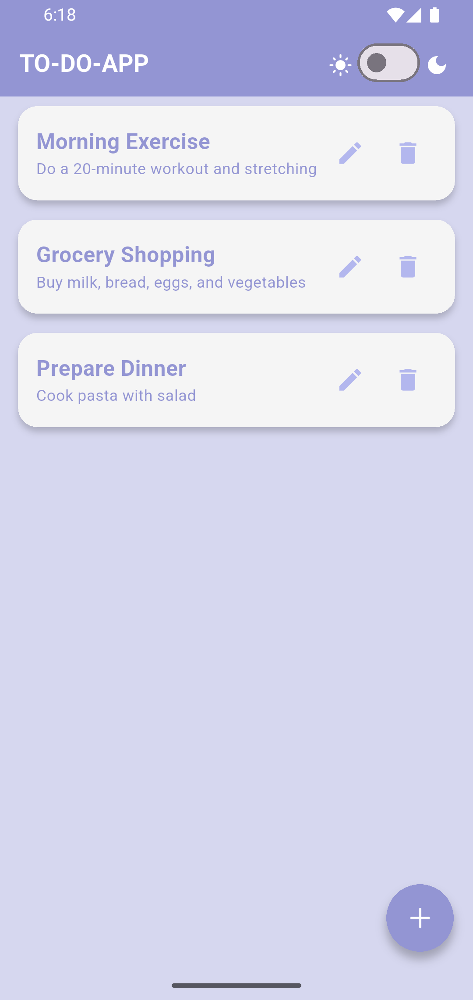
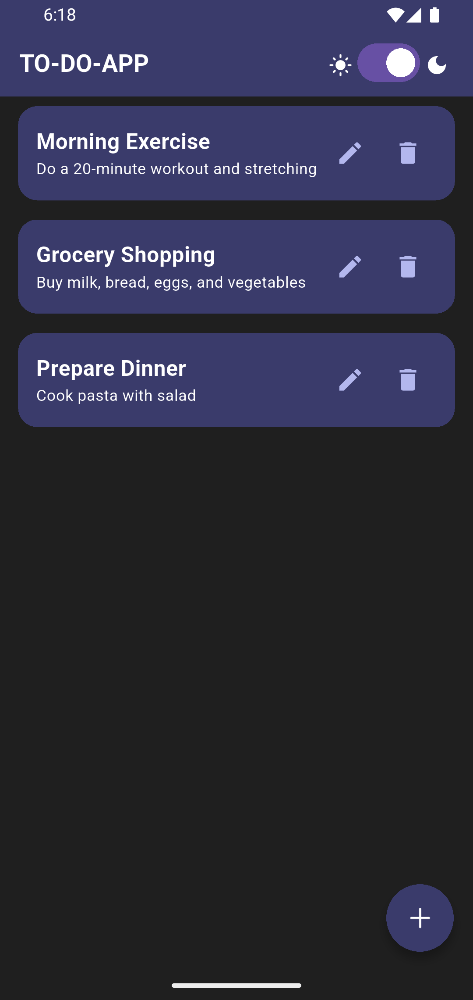

# 📝 To-Do Application

A simple and modern To-Do application built with **Flutter**.  
This app helps you manage daily tasks with an easy-to-use interface and supports both **Light** and **Dark** themes.  

---

## 🚀 Features
- Add, edit, and delete tasks
- Mark tasks as completed
- Light & Dark mode support
- Persistent storage with Hive
- Clean and responsive UI

---

## 📸 Screenshots

| Light Mode | Dark Mode |
|------------|-----------|
|  |  |

> ℹ️ Add your app screenshots in the `screenshots` folder and update the paths above.

---

## 🛠️ Installation & Usage
1. Clone the repository:
   ```bash
   git clone https://github.com/amirmohammadfluttercode-lang/To-Do-Application.git
