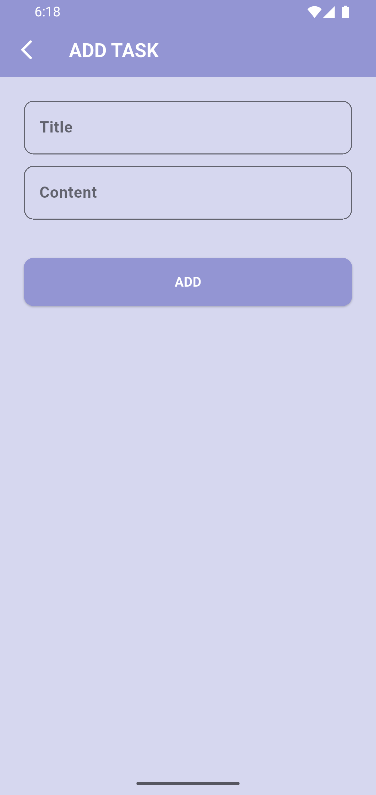

# 📝 To-Do Application

A simple and modern to-do app built with **Flutter**.
This app helps you manage your daily tasks with an easy-to-use interface and supports both **light** and **dark** themes.
You will learn to work with **Hive** and **Models** better by doing this project.

---

## 🚀 Features
- Add, edit, and delete tasks
- Light & Dark mode support
- Persistent storage with Hive
- Clean and responsive UI

---

---
## 🛠️ Installation & Usage
1. Clone the repository:
   ```bash
   git clone https://github.com/amirmohammadfluttercode-lang/To-Do-Application.git
2. Navigate to project folder:
   ```bash
   cd To-Do-Application-main
3. Install dependencies:
   ```bash
   flutter pub get
4. Run the app:
   ```bash
   flutter run
---

## 📸 Screenshots

| Light Mode🌄 | Dark Mode🌇 |
|------------|-----------|
|  |  |
|  |  |
|  |  |
|  |

---
